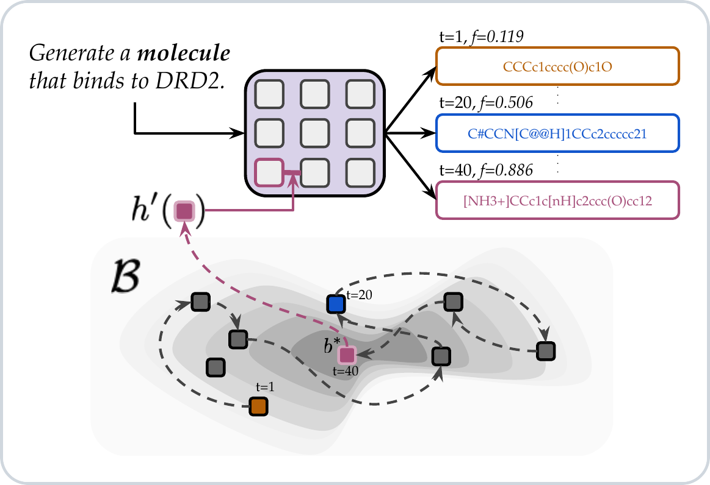

<div align="center">

# BOReFT: Manifold Steering of Language Models for Black-box Optimization

[Dhruv Agarwal](mailto:dagarwal@cs.umass.edu)<sup>1</sup> &nbsp; Rico Angell<sup>2</sup> &nbsp; Kavitha Srinivas<sup>3</sup> &nbsp; Tahira Naseem<sup>3</sup><br>Horst Samulowitz<sup>3</sup> &nbsp; Willie Neiswanger<sup>4</sup> &nbsp; Andrew McCallum<sup>1</sup>

<sup>1</sup>University of Massachusetts Amherst &ensp; <sup>2</sup>New York University &ensp; <sup>3</sup>IBM Research &ensp; <sup>4</sup>University of Southern California

[](https://arxiv.org/abs/XXXX.XXXXX)
[](LICENSE)



</div>

<br>

**BOReFT** (_Bayesian Optimization via Representation Finetuning_) learns a low-dimensional hidden-state intervention manifold in a frozen language model using a training set of candidate solutions, and searches over it with Bayesian optimization to generate new solutions for black-box search and discovery. `python -m boreft.train --help` and `python -m boreft.search --help` list every flag.


## Setup

```bash
pip install torch==2.5.1 --index-url https://download.pytorch.org/whl/cu121
pip install -r requirements.txt
pip install -e .
```

Base models download from Hugging Face on the first run. Set `HF_HOME` to choose the cache. Weights & Biases logging uses `WANDB_PROJECT` and `WANDB_ENTITY` when you set them; omit the `--wandb-*` flags to train without it.

Training data is already in the repo:

- Semantle words and definitions: `data/semantle/train/`
- Molecule SMILES and ChEBI descriptions: `data/molopt/train/`

Rebuild the molecule files from ChEBI-20 with `python scripts/prepare_molopt_chebi20.py --download`.

A training run writes its checkpoint to `--output-dir`. Re-running into the same directory overwrites that run.

## Train

Both tasks use rank 64 at the first transformer layer (`--layer 0 --position marker`), a variational posterior, self-distillation, and a shared bias network. Semantle trains Llama-3.2-1B-Instruct with its chat template, and reads descriptions with that same model. Molecule optimization trains the [MiST](https://figshare.com/articles/code/29132657) chemistry-pretrained Qwen2.5-3B checkpoint as a completion model, wraps targets in MiST SMILES tags, and reads descriptions with Qwen3-Embedding-0.6B.

### Semantle

The paper uses 3072 training words. `experiments/semantle/train_n512.sh` is the same recipe at 512 words.

```bash
python -m boreft.train \
  --task semantle \
  --output-dir outputs/semantle \
  --semantle-csv data/semantle/train/computer.csv \
  --semantle-dir data/semantle/train \
  --train-top-k 4000 \
  --train-n-samples 3072 \
  --model-name meta-llama/Llama-3.2-1B-Instruct \
  --use-chat-template \
  --low-rank-dim 64 \
  --layer 0 \
  --position marker \
  --intervention-inject prefix \
  --batch-size 32 \
  --epochs 240 \
  --lr 1e-3 \
  --lr-scheduler-type cosine \
  --warmup-ratio 0.1 \
  --lambda-ce 1 \
  --bias-type vae \
  --variance learnable \
  --kl-beta 1.0 \
  --vae-free-bits-lambda 25e-3 \
  --kl-prior-var 1 \
  --lambda-sdpo 1 \
  --sdpo-include-gold \
  --sdpo-n-onpolicy 4 \
  --sdpo-max-new-tokens 32 \
  --add-bias-network \
  --bias-network-residual \
  --use-definition-embeds \
  --bias-network-encoder llm_encoder \
  --weight-decay-mode W_and_b \
  --wd-b 1e-1 \
  --wd-W 1e-1
```

### Molecule optimization

The prepared corpus is the 8,000-molecule ChEBI-20 subset in `data/molopt/train/chebi20.csv`. By default the train pool is molecules at or below the 90th percentile of DRD2, GSK3β, and JNK3, and `--train-n-samples 1024` draws the paper's training set from that pool. The weights are the `qwen_pretranined_v6` directory in the [MiST model release](https://figshare.com/articles/code/29132657). Pass that extracted directory as `--model-name`.

```bash
python -m boreft.train \
  --task molopt \
  --output-dir outputs/molopt \
  --molopt-csv data/molopt/train/chebi20.csv \
  --train-n-samples 1024 \
  --model-name /path/to/qwen_pretranined_v6 \
  --mist-smiles-tags \
  --low-rank-dim 64 \
  --layer 0 \
  --position marker \
  --intervention-inject prefix \
  --batch-size 32 \
  --epochs 240 \
  --lr 1e-3 \
  --lr-scheduler-type cosine \
  --warmup-ratio 0.1 \
  --lambda-ce 1 \
  --bias-type vae \
  --variance learnable \
  --kl-beta 1e-3 \
  --vae-free-bits-lambda 25e-3 \
  --kl-prior-var 1 \
  --lambda-sdpo 1 \
  --sdpo-include-gold \
  --sdpo-n-onpolicy 4 \
  --add-bias-network \
  --bias-network-residual \
  --use-definition-embeds
```

## Search

`boreft.search` runs Bayesian optimization over the box of posterior means saved in a checkpoint. The paper uses a projected Gaussian-process surrogate (one `Linear → ELU` layer of width 64, trained with the GP), log expected improvement, 10 checkpoint warm starts, and a budget of 500 scores. Semantle decodes greedily. Molecule optimization samples at temperature 1 and scores a property oracle (`DRD2`, `GSK3B`, or `JNK3`).

```bash
python -m boreft.search \
  --output-dir outputs/semantle \
  --search-dir outputs/semantle/search/apple \
  --target apple \
  --surrogate projected \
  --projection-dim 64 \
  --use-ard \
  --acquisition log_ei \
  --warmstart-source checkpoint \
  --warmstart-count 10 \
  --budget 500 \
  --observation-samples 1 \
  --sampling-temperature 0 \
  --seeds 1 2 3
```

```bash
python -m boreft.search \
  --output-dir outputs/molopt \
  --search-dir outputs/molopt/search/DRD2 \
  --target DRD2 \
  --oracle DRD2 \
  --surrogate projected \
  --projection-dim 64 \
  --use-ard \
  --acquisition log_ei \
  --warmstart-source checkpoint \
  --warmstart-count 10 \
  --budget 500 \
  --observation-samples 1 \
  --sampling-temperature 1 \
  --seeds 1 2 3 4 5
```

Each seed writes `observations.jsonl`, `summary.json`, and a best-so-far plot under `--search-dir`. `--budget` counts objective evaluations. `--resume` continues a run without rescoring finished points.

`experiments/semantle/` and `experiments/molopt/` submit this protocol, and the baselines below, through `sbatch`. For example:

```bash
./experiments/semantle/boreft.sh --boreft_dir outputs/semantle
./experiments/molopt/boreft.sh --boreft_dir outputs/molopt
```

## Search baselines

`boreft.baselines.search` runs the same budget, warm starts, and output layout as `boreft.search`. Baselines:

| `--baseline` | Method |
|---|---|
| `random_sampling` | Repeated sampling from the base model |
| `discrete_bo` | Bayesian optimization over a frozen candidate pool |
| `opro` | Optimization by prompting |
| `sdpo_ttt` | Self-distilled test-time training |
| `bopro` | Bayesian optimization in embedding space |
| `migrate` | MiGrATe |
| `autodiscovery` | AutoDiscovery |

```bash
python -m boreft.baselines.search \
  --baseline opro \
  --task-description "Generate an English word as a guess to find the hidden word (only the word, without any decoration or formatting)." \
  --target apple \
  --reft-output-dir outputs/semantle \
  --search-dir outputs/semantle/search_opro/apple \
  --budget 500 \
  --warmstart-count 10 \
  --warmstart-source checkpoint \
  --seeds 1 2 3
```

Method options are nested flags such as `--opro.history-count`, `--bopro.neighbors`, `--discrete-bo.candidate-count`, `--sdpo-ttt.n-onpolicy`, `--migrate.on-policy-count`, and `--autodiscovery.exploration-constant`. See `python -m boreft.baselines.search --help`.

The paper also compares those methods after a LoRA adapter is trained on the same words or molecules. Train that adapter with `python -m boreft.baselines.lora_sft --help`. The matching launchers are `experiments/semantle/<method>.sh` and `experiments/molopt/<method>.sh`.

## REPL

`scripts/repl.py` loads a checkpoint once and takes prompts in a loop. Start on the base model, then attach a trained intervention without reloading.

```bash
python scripts/repl.py --checkpoint-dir outputs/semantle
python scripts/repl.py --checkpoint-dir outputs/semantle --target computer
python scripts/repl.py --checkpoint-dir outputs/molopt --check-smiles
```

| Command | What it does |
|---|---|
| `/target <word>` | Intervene with the posterior mean of a training target |
| `/target-list` | List training targets |
| `/zero` | Intervention on, bias vector zero |
| `/base` | Base model, no intervention |
| `/temp <float>` / `/temp off` | Sample, or decode greedily |
| `/interpolate [lerp\|slerp] <w1> <w2> <n_steps>` | Decode along the path between two training targets |

Checkpoints trained with `--add-bias-network` also accept `/target-test <word>`, `/target-text <text>`, and `/learn <target> :: <definition>`, which fits a bias for an unseen target and appends it to `learned_biases.jsonl`. `/help` lists the rest. `--use-checkpoint-prompt` ignores typed text and always uses the saved eval prompt.

## Subspace explorer

`scripts/subspace_viz.py` serves a browser UI for the same checkpoint. It plots training and learned biases on their first two principal components, and uses the full-rank vector when you select a point. Clicking empty space activates the inverse-PCA code at that location.

```bash
# On the GPU node:
python scripts/subspace_viz.py --checkpoint-dir outputs/semantle --port 8000

# On your machine:
ssh -L 8000:127.0.0.1:8000 user@gpu-node
```

Then open `http://127.0.0.1:8000`. The page can chat with the intervened model, switch to base and zero-bias modes, and show definition tooltips. Test-set points and free-text queries need a bias-network checkpoint. The recovery controls fit new biases for points the model misses and write a sibling checkpoint named `<checkpoint>-recovery-<timestamp>-<id>`, leaving the original directory unchanged.

## 📝 Citation

```bibtex
@article{agarwal2026boreft,
  title   = {BOReFT: Manifold Steering of Language Models for Black-box Optimization},
  author  = {Agarwal, Dhruv and Angell, Rico and Srinivas, Kavitha and Naseem, Tahira and Samulowitz, Horst and Neiswanger, Willie and McCallum, Andrew},
  journal = {arXiv preprint arXiv:XXXX.XXXXX},
  year    = {2026},
  url     = {https://arxiv.org/abs/XXXX.XXXXX}
}
```

## ✉️ Get in touch!

Questions and feedback: [dagarwal@cs.umass.edu](mailto:dagarwal@cs.umass.edu)
